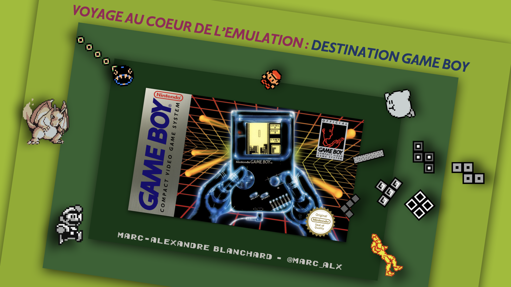

# Voyage au coeur de l'émulation : destination Game Boy

Dépôt contenant les slides de la présentation "Voyage au coeur de l'émulation : destination Game Boy".

_Repo for the talk "A Journey into the heart of Emulation: Destination Game Boy" this repo is in french 🇫🇷._

## Abstract

>Venez découvrir comment, au détour d'une vidéo YouTube sur l'émulation et d'un « mais ça, je peux le faire » , j'ai embarqué dans un voyage au croisement de l'informatique, de l'électronique, du gaming, de l'audio et même du droit.
>
>On se dirige tout droit vers la nostalgie et pas n'importe laquelle : celle des gros pixels, des sons 8 bits, des cartouches de jeux, des piles AA chipées dans la télécommande du salon, des tétrominos, des 151 premiers Pokémon : de la Nintendo Game Boy !
>
>Ce talk, c’est le récit d’un side project très nerdy : développer un émulateur Game Boy. Du premier pixel affiché aux premières notes entendues, vous découvrirez une multitude de défis techniques : compréhension du matériel, reverse engineering, audio/video processing, optimisation des performances, qualité logicielle et techniques de déboggage. Au-delà du fun et de la nostalgie, ce projet montre à quel point l’émulation est un formidable terrain d’apprentissage pour tout développeur.
>
>Voici quelques-unes des questions auxquelles on va répondre :
>
>- Par où commence-t-on un projet pareil ?
>- Quelles sont les différentes techniques modernes d’émulation ?
>- Comment architecturer un émulateur ?
>- Ça prend combien de temps d’émuler une console ?
>- Comment fait-on pour émuler le son ?
>- Comment sait-on qu'un émulateur est fiable ?
>- Comment débogguer un programme qui ne renvoie pas d'erreur ?
>- Et surtout : c’est légal tout ça ?

## Sessions

### SnowCamp 2026

- [45 min] **Voyage au coeur de l'émulation : destination Game Boy** (_A Journey into the heart of Emulation: Destination Game Boy_) - [[slides]()] - [[ref. 1](https://app.voxxr.in/events/snowcamp26/talks/21/details)] [[ref. 2](./references/SnowCamp%202026.png)] [[ref. 3](./references/SnowCamp%202026%20-%202.png)]

## Resources

• Emulation backend presented during this talk: [GBKit](https://github.com/MarcAlx/GBKit)

• Emulation frontend presented during this talk: [gb](https://github.com/MarcAlx/gb)

## Credits

• Game Boy 1989 font family designed by NotSoArtisty

• Early Game Boy font family designed by Jimmy Campbell

• Most console photos are my own, ask for permission before use

• Logos and images are the property of their respective owners and are used here strictly for illustrative and educational purposes.

## Sidenotes

_n.b slides are created with Apple Keynote (.key file), Microsoft PowerPoint version provided for compatibility purpose._